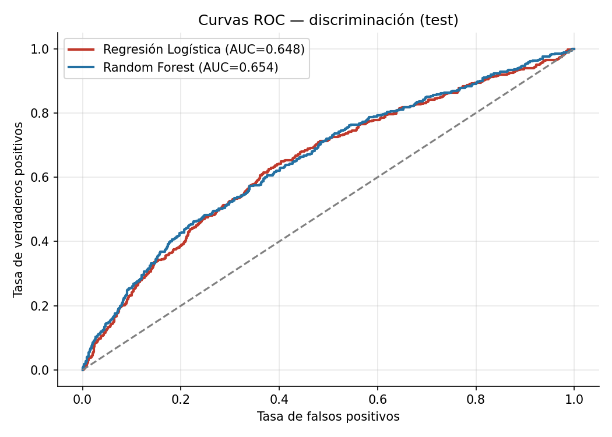
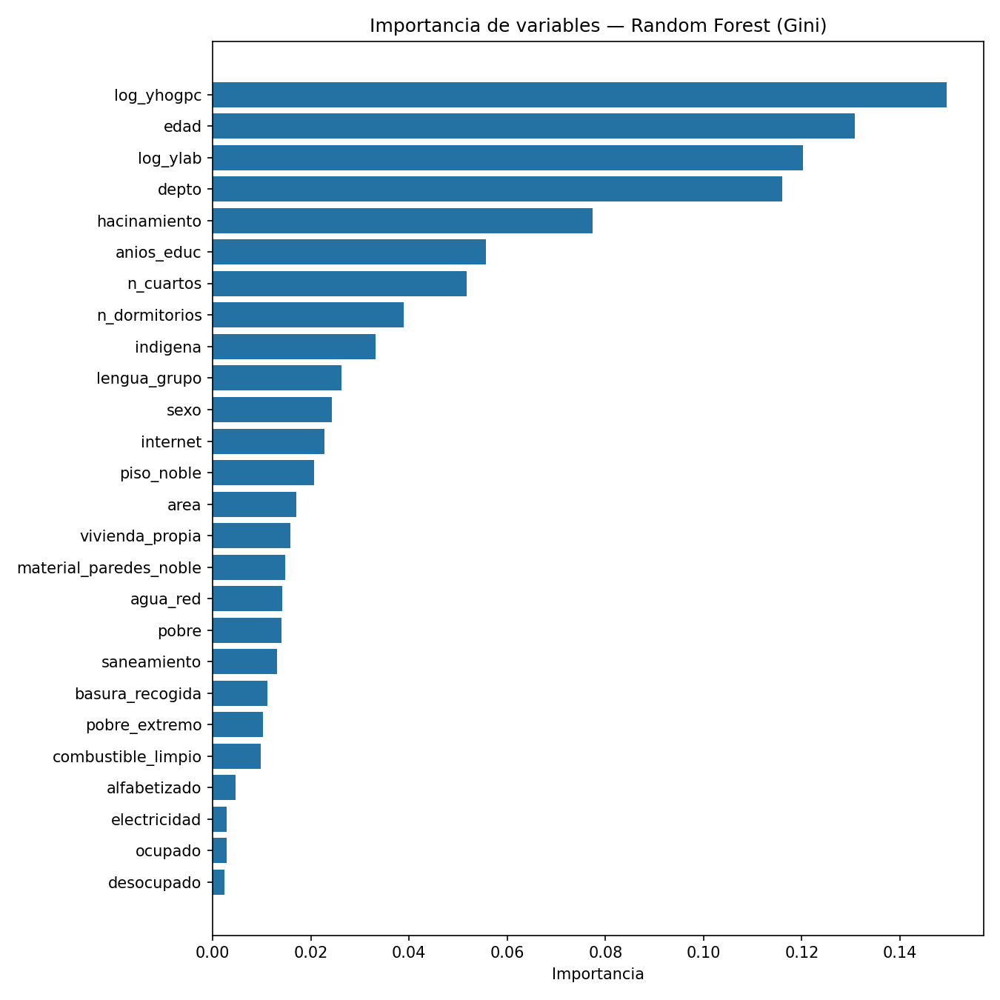

# Discriminación y Seguridad Ciudadana en Bolivia — EH2025 (Caso 3)

**Análisis de Datos Masivos con Machine Learning · Módulo 3 · Sesión 2**

Análisis completo de la **Encuesta de Hogares 2025 (EH2025)** del **INE Bolivia** sobre el módulo de *Discriminación y Seguridad Ciudadana*, ejecutado íntegramente en **Google Colab** con datos obtenidos de **ANDA** (microdatos), y publicado en GitHub.


## Estructura del repositorio

```
├── notebooks/                 # Notebook de Colab con todo el pipeline (CRISP-DM)
├── data/procesado/            # dataset_procesado.csv, predicciones.csv, mapa_discriminacion.html
├── imagenes/                  # 11 visualizaciones generadas (PNG)
├── docs/                      # storytelling_discriminacion.pdf (informe narrativo)
└── Capturas/                  # Evidencias paso a paso por fase (Parte1..Parte4)
```

## Contenido del análisis

| Fase | Contenido | Rúbrica |
|------|-----------|---------|
| 1. Obtención y preprocesamiento | ANDA → microdatos EH2025 (Persona, Vivienda, Discriminación); fusión por folio; target *sufrió discriminación*; 26 predictores; factor de expansión | 25% |
| 2. EDA | Mapa Folium por departamento, motivos de discriminación, edad/sexo/ingreso y clustering K-means+PCA | 25% |
| 3. Machine Learning | Regresión Logística y Random Forest (clase balanceada); métricas de test: exactitud, precisión, sensibilidad, F1, AUC-ROC, matrices de confusión, ROC, importancia de variables y SHAP | 25% |
| 4. Storytelling y publicación | Informe narrativo en PDF y publicación de este repositorio público | 25% |

## Resultados (conjunto de TEST, 25%)

| Modelo | Exactitud | Precisión | Sensibilidad | F1 | AUC-ROC |
|--------|-----------|-----------|--------------|-----|---------|
| Regresión Logística | 0.6337 | 0.2225 | 0.5943 | 0.3238 | 0.6482 |
| Random Forest | 0.8068 | 0.3120 | 0.2566 | 0.2816 | 0.6545 |

Hallazgos clave: la prevalencia nacional de discriminación en 12 meses fue ~ **14%**; el motivo más frecuente es el **color de piel**; el departamento con mayor tasa reportada es **La Paz (23.3%)** y el menor **Tarija (8.2%)**; la inseguridad percibida al caminar de noche supera el 45% en varios departamentos.

## Cómo ejecutar

1. Abrir `notebooks/EH2025_Analisis_ML_Caso3.ipynb` en [Google Colab](https://colab.research.google.com/).
2. Subir los archivos `data/` desde el catálogo ANDA del INE (EH2025) y el GeoJSON de departamentos.
3. Ejecutar todas las celdas (Runtime → Ejecutar todas).

## Evidencias paso a paso

Capturas de cada etapa guardadas en `Capturas/`:

- `Parte1_Datos/` — Catálogo ANDA, descarga de microdatos y carga en Colab.
- `Parte2_EDA/` — Mapa, motivos, relación edad/sexo/ingreso y clustering.
- `Parte3_ML/` — Métricas, matrices de confusión, ROC, importancia y SHAP.
- `Parte4_Storytelling/` — Generación del PDF, descargas y publicación en GitHub.





**Autor:** JOSE CHIPANA · Educación Superior · Análisis de Datos Masivos con ML · Sesión 2 · Caso 3