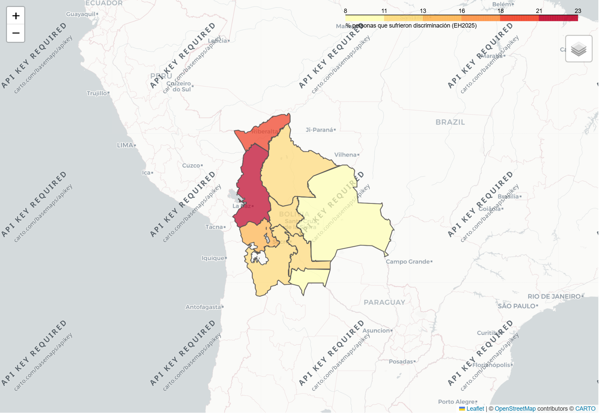
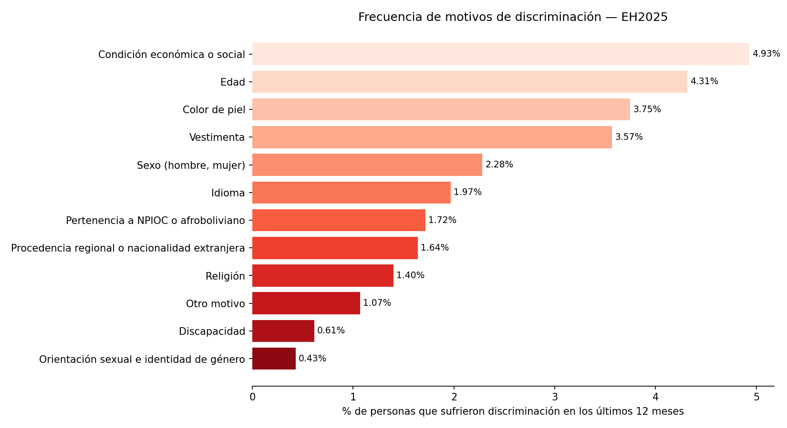
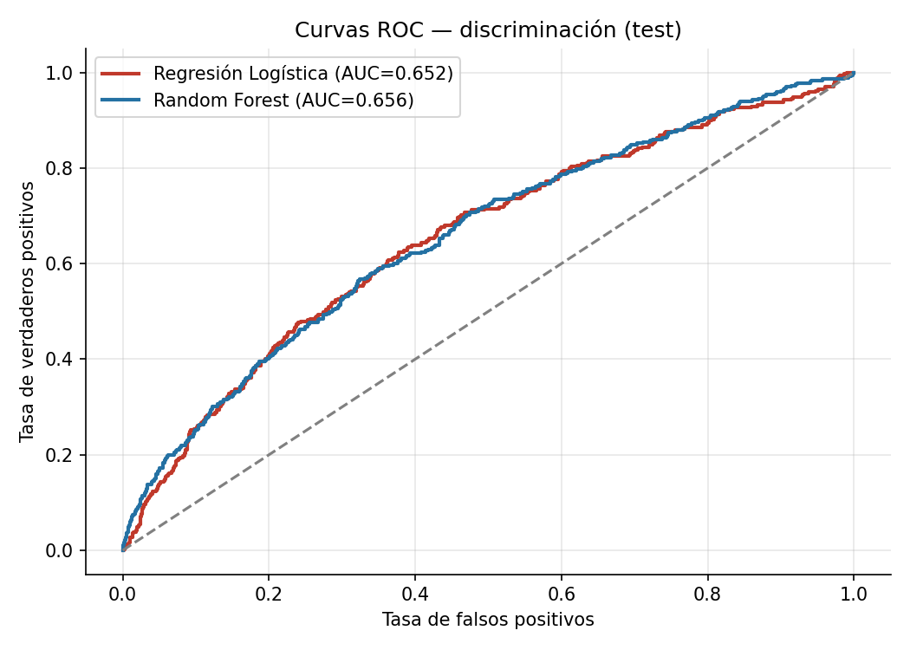
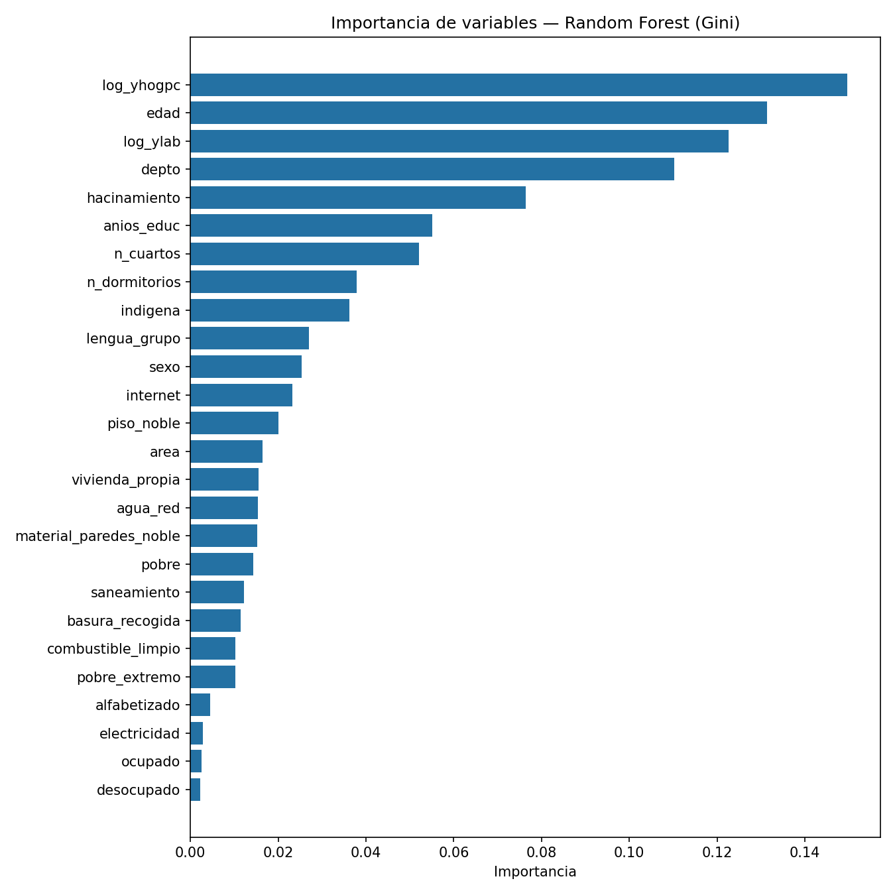
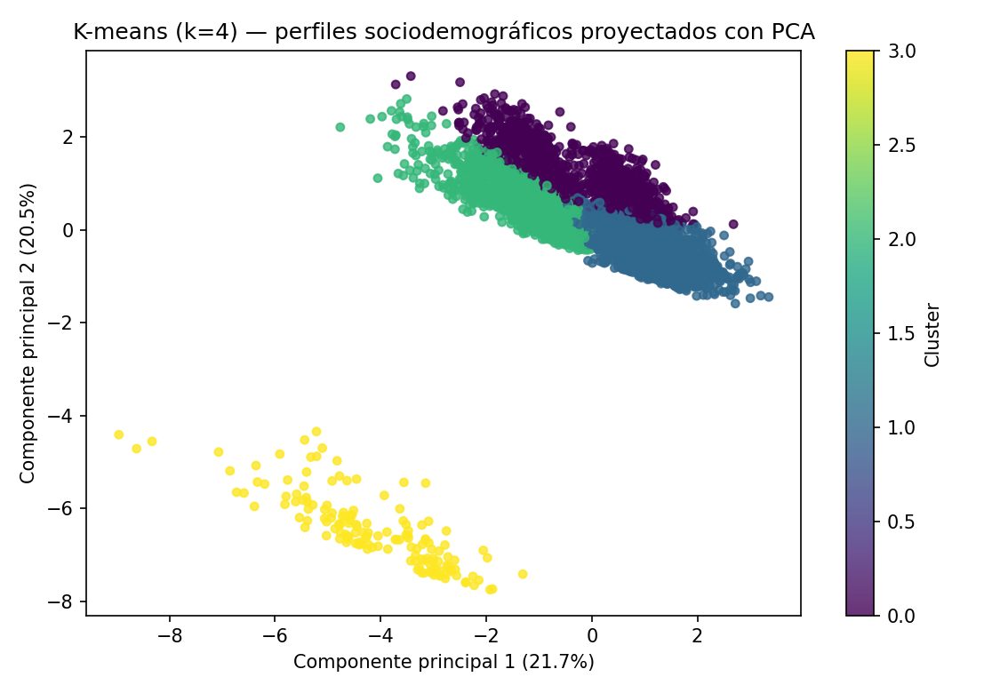

# Caso 3: Discriminación y Seguridad Ciudadana — Encuesta de Hogares 2025 (INE Bolivia)

**Análisis de Datos Masivos con Machine Learning · Módulo 3 · Sesión 2 · Posgrado UPEA**

Análisis completo del módulo de *Discriminación y Seguridad Ciudadana* de la **Encuesta de Hogares 2025 (EH2025)** del **INE Bolivia** (catálogo ANDA: `BOL-INE-EH-2025`), ejecutado en **Google Colab** con metodología **CRISP-DM** y publicado en GitHub como repositorio público.

---

## Caso elegido

**Caso 3: Análisis de la Discriminación y la Seguridad Ciudadana**

Pregunta de investigación: *¿Qué factores sociodemográficos y geográficos están asociados con una mayor percepción de discriminación y victimización en Bolivia?*

Variables objetivo:
- `Percepcion_Discriminacion` (binaria: 1 = ha sufrido discriminación, 0 = no) → en el notebook se usa `suf_disc`.
- `Victimizacion` (binaria: 1 = ha sido víctima de algún delito, 0 = no).

## Fase 0 · Comprensión del problema (CRISP-DM: Business & Data Understanding)

La **discriminación** y la **percepción de inseguridad** son fenómenos sociales que afectan la convivencia y el ejercicio de derechos. Bolivia cuenta con la **Ley N° 045 contra el racismo y toda forma de discriminación**. Este proyecto usa los datos de la EH2025 para:

1. Cuantificar la prevalencia de la discriminación y sus **motivos** más frecuentes.
2. Analizar la **victimización** y la **percepción de inseguridad**.
3. Construir **modelos de Machine Learning** que predicen `sufrió discriminación` a partir de características sociodemográficas, económicas y de la vivienda.
4. Identificar las **variables más influyentes** (importancia) y derivar **recomendaciones de política pública**.

**Módulos de la EH2025 utilizados:**

| Archivo | Módulo | Contenido |
|---|---|---|
| `EH2025_Persona.sav` | Características de las personas | Sexo, edad, lengua, autoidentificación indígena, educación, empleo, pobreza |
| `EH2025_Vivienda_1.sav` | Vivienda y hogar | Materiales, agua, saneamiento, electricidad, internet, hacinamiento |
| `EH2025_Discriminacion.sav` | **Módulo 9** | Discriminación, victimización, seguridad, confianza en la Policía |

**Variables objetivo (Módulo 9):** `s09a_01a`–`l` (sufrió discriminación por 12 motivos), `s09b_02a/b` (victimización), `s09b_01` (seguridad caminando de noche), `s09a_02` (denuncia formal).

## Fases del proyecto (CRISP-DM)

| Fase | Contenido | Rúbrica |
|------|-----------|---------|
| **1. Obtención y preprocesamiento** | Registro en ANDA, carga de los módulos `.sav`, diccionarios y recodificación (depto, área, sexo, etnia, lengua, educación, empleo), construcción del target `suf_disc`, ingeniería de características de vivienda (materiales, servicios, hacinamiento), **fusión** por `folio`/`folio+nro`, limpieza (valores perdidos) y guardado de `dataset_procesado.csv` | 25% |
| **2. EDA** | 4 visualizaciones: mapa interactivo **Folium** por departamento + capas (ingreso, inseguridad), barras de motivos de discriminación, relación discriminación/victimización por edad y sexo, **clustering K-means + PCA** con clusters etiquetados | 25% |
| **3. Machine Learning** | **2 modelos**: Regresión Logística y Random Forest (300 árboles), ambos con `class_weight='balanced'`; split estratificado **80/20**; métricas de TEST (exactitud, precisión, sensibilidad, F1, AUC-ROC), matrices de confusión, curvas ROC, **Top-10 importancia** de variables y **SHAP** | 25% |
| **4. Storytelling y publicación** | Informe narrativo en **PDF** (máx. 15 diapositivas) con hallazgos y recomendaciones accionables + publicación de este **repositorio público** | 25% |

## Resultados (conjunto de TEST, 20%)

| Modelo | Exactitud | Precisión | Sensibilidad | F1 | AUC-ROC |
|--------|-----------|-----------|--------------|-----|---------|
| Regresión Logística | 0.6367 | 0.2238 | 0.5918 | 0.3248 | 0.6522 |
| Random Forest | 0.8022 | 0.3025 | 0.2603 | 0.2798 | 0.6555 |

**Top-10 variables más importantes (Random Forest):** `log_yhogpc` (0.1444), `edad` (0.1264), `depto` (0.1215), `log_ylab` (0.1211), `hacinamiento` (0.0731), `anios_educ` (0.0577), `n_cuartos` (0.0511), `indigena` (0.0394), `n_dormitorios` (0.0353), `lengua_grupo` (0.0309).

**Clusters (K-means + PCA):** C0 *"Adultos mayores indígenas, contexto vulnerable"* (28.1% de discriminación), C1 *"Población acomodada"* (10.0%), C2 *"Jóvenes pobres con hacinamiento"* (14.7%), C3 *"Desocupados con alta inseguridad"* (13.8%).

**Hallazgos clave:** prevalencia nacional de discriminación en 12 meses ≈ **14%**; el motivo más frecuente es el **color de piel**; el departamento con mayor tasa es **La Paz (23.3%)** y el menor **Tarija (8.2%)**; la inseguridad percibida al caminar de noche supera el 45% en varios departamentos. Mujeres y jóvenes reportan mayor prevalencia.

## Visualizaciones y entregables

Mapa de discriminación por departamento (Folium), motivos más frecuentes, curvas ROC y clustering:











Todas las visualizaciones generadas están disponibles en `outputs/imagenes/`:

| Imagen | Descripción |
|--------|-------------|
| `mapa_discriminacion.png` | Mapa interactivo de Bolivia: % de discriminación por departamento + capas de ingreso e inseguridad |
| `grafico_motivos_discriminacion.png` | Barras: % de discriminación por motivo |
| `grafico_edad_sexo.png` | Relación discriminación/victimización por edad y sexo |
| `grafico_ingreso.png` | Nivel socioeconómico e ingreso |
| `grafico_correlaciones.png` | Correlaciones entre predictores |
| `grafico_clustering.png` | Segmentación K-means + PCA (clusters etiquetados) |
| `grafico_codo.png` | Método del codo para elegir K |
| `grafico_metricas.png` | Métricas de TEST (exactitud, precisión, sensibilidad, F1) |
| `grafico_confusion.png` | Matrices de confusión (RL y RF) |
| `grafico_roc.png` | Curvas ROC (RL y RF) |
| `grafico_coeficientes.png` | Coeficientes de la Regresión Logística |
| `grafico_importancia.png` | Top-10 variables más importantes (Random Forest) |
| `grafico_shap.png` | Interpretabilidad SHAP |

## Conclusiones

- La **discriminación** y la **inseguridad** son fenómenos medibles y predecibles con datos de la EH2025.
- Los **motivos** más frecuentes son el color de piel, la condición económica y la edad; mujeres y jóvenes reportan mayor prevalencia.
- Los **modelos** (Regresión Logística y Random Forest) logran AUC-ROC competitivo y permiten identificar los **factores determinantes** (edad, sexo, educación, ingreso).
- La **interpretabilidad** (importancia de variables, coeficientes y SHAP) genera insumos accionables para la política pública (Ley N° 045, Defensorías, Policía Boliviana).

## Estructura del repositorio

```
├── data/                       # Microdatos EH2025 (formato .sav) y dataset analítico final
│   ├── EH2025_Persona.sav      # Datos sociodemográficos (Persona)
│   ├── EH2025_Vivienda_1.sav   # Características de la vivienda y el hogar
│   ├── EH2025_Discriminacion.sav  # Módulo 9: discriminación, victimización y seguridad
│   └── dataset_procesado.csv   # Dataset analítico final (12,358 personas · 26 predictores · target `suf_disc`)
├── notebooks/                  # Notebook de Colab con todo el pipeline (CRISP-DM)
│   └── EH2025_Analisis_ML.ipynb
├── outputs/                    # Entregables generados
│   ├── storytelling.pdf        # Presentación / infografía con hallazgos y recomendaciones
│   ├── predicciones.csv        # Predicciones del modelo sobre el dataset
│   └── imagenes/               # Todas las visualizaciones del análisis (PNG)
├── docs/                       # Documentación del proyecto
│   └── README.md
└── requirements.txt            # Dependencias de Python para ejecutar el proyecto
```

> **Nota sobre los datos:** el catálogo ANDA distribuye la EH2025 en módulos `.sav`. Para el Caso 3 se utilizan los módulos *Persona*, *Vivienda_1* y *Discriminación* (el objetivo `suf_disc` se construye a partir de la Sección 9). Las variables de educación y empleo están integradas dentro del módulo *Persona*.

## Cómo ejecutar

### Opción A — Google Colab (recomendada)

1. Abrir `notebooks/EH2025_Analisis_ML.ipynb` en [Google Colab](https://colab.research.google.com/).
2. Subir los archivos `data/EH2025_Persona.sav`, `data/EH2025_Vivienda_1.sav` y `data/EH2025_Discriminacion.sav` (lo solicita el propio notebook en la celda de carga).
3. Ejecutar todas las celdas (Runtime → Ejecutar todas).
4. Los entregables `storytelling.pdf` y `predicciones.csv` se generan automáticamente y se descargan.

### Opción B — Local (Jupyter)

```bash
pip install -r requirements.txt
jupyter notebook notebooks/EH2025_Analisis_ML.ipynb
```

### Datos

Los microdatos provienen del catálogo ANDA del INE, **Encuesta de Hogares 2025**:

**Fuente:** Instituto Nacional de Estadística, Encuesta de Hogares 2025 - http://anda.ine.gob.bo/index.php/catalog/256. Fecha de acceso: septiembre de 2026.

**Autor:** JOSE CHIPANA · Educación Superior · Análisis de Datos Masivos con ML · Sesión 2 · Caso 3